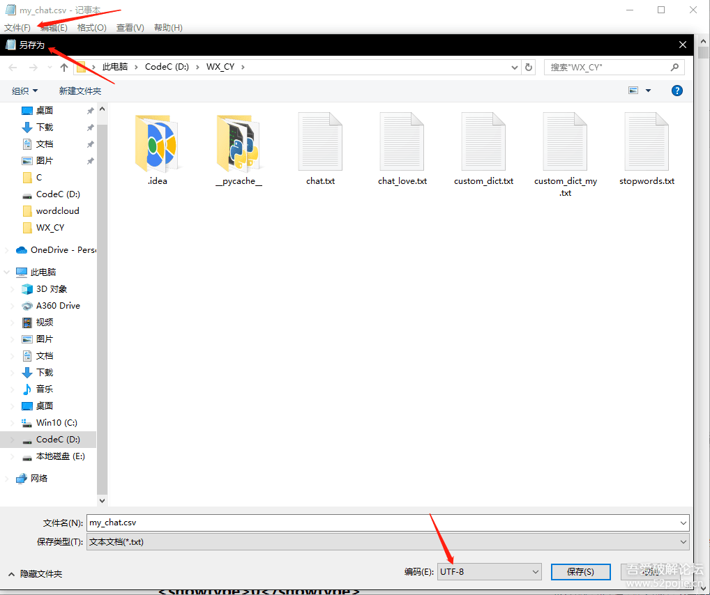

> 原文：https://www.52pojie.cn/thread-1154638-1-1.html

代码

```python
import csv, jieba, re
from itertools import islice
import pandas as pd
import imageio
import matplotlib.pyplot as plt
from wordcloud import WordCloud, ImageColorGenerator
 
 
# 从导出的csv格式聊天记录中提取中文存入txt文件中
def csv_to_txt():
    chat_csv = open("my_chat.csv","r",encoding="utf-8") #chatlog.csv 改成自己的聊天记录文件名
    my_chat = csv.reader(chat_csv)
    fp = open("chat.txt", "w+", encoding="utf-8")
    for line in islice(my_chat, 1, None):
        if re.search("[\u4e00-\u9fa5]", line[8]) and len(line[8]) < 50:
            fp.write(line[8] + "\n")
    fp.close()
 
 
# 对聊天记录文件进行分词
def cut_words():
    # 把聊天内容读取给content
    fp = open("chat.txt", "r", encoding="utf-8")
    content = fp.read()
    fp.close()
    jieba.load_userdict("custom_dict.txt")  # 载入自定义词典（格式：一个词占一行；每行分为：词语、词频（可省略）、词性（可省略），用空格隔开）
    words = jieba.cut(content)  # 进行分词，模式：精确模式
    word_L = []  # 把分词结果存入word_L中
    # 加载停用词
    with open("stopwords.txt", 'r', encoding="utf-8") as ss:
        stopwords = ss.read()
    # 把符合的词语存入word_L中
    for word in words:
        if word not in stopwords and word != '\n' and len(word) > 1:
            word_L.append(word)
    return word_L
 
 
# 生成词云
def word_cloud(words):
    # 对分词结果进行频率统计再转换成字典
    count_word_df = pd.DataFrame({"word":words}).groupby(["word"]).size()
    count_word_dt = count_word_df.to_dict()
    mk = imageio.imread('my_pic.jpg')  # 设置词云形状
    mk_color = ImageColorGenerator(mk)  # 设置词云颜色
    # 配置词云参数
    wx_wc = WordCloud(
        background_color="white",  # 如果是透明背景，设置background_color=None
        mode="RGB",  # 如果是透明背景，设置mode="RGBA"
        mask=mk,  # 词云形状
        font_path="青鸟华光简胖头鱼.TTF",  # 字体可以更改为自己喜欢的字体，在C:\Windows\Fonts文件夹
        scale=3,  # 如果输出图片大小不满意，则修改此值
    )
    wx_wc = wx_wc.generate_from_frequencies(count_word_dt)  # 把带频率的分词结果导入词云
    wx_wc.to_file("wordcloud.png")  # 输出词云图片，未设置颜色
 
    # plt输出图片
    plt.axis("off")  # 关闭坐标轴
    plt.imshow(wx_wc.recolor(color_func=mk_color)) # 设置颜色
    plt.savefig('pltwordcloud.png', dpi=400)  # 输出词云图片，以原图片为背景色
 
 
def run():
    csv_to_txt()
    words = cut_words()
    word_cloud(words)
 
if __name__ == '__main__':
    run()
```

效果:


## 如何获取聊天记录

          1. 你需要**和谁的聊天记录**生成词云，就把**和她的聊天记录**通过**电脑版微信**备份一下，然后通过安卓模拟器再把她的聊天记录从 **电脑版微信** 恢复到 **模拟器的微信** 里面。
          2. 通过re或者类似**文件管理器**找到这个/data/data/com.tencent.mm/MicroMsg路径，下面有一个数字和字母组成名称很长的文件夹，把里面**EnMicroMsg.db**文件取出到电脑里备用
          3. /data/data/com.tencent.mm/shared_prefs路径下有一个**auth_info_key_prefs.xml**文件，记住里面的**_auth_uin**值(这个值可能是**9位**,**10位**或者**负数**)备用
          4. 打开模拟器的设置界面，记住**IMEI**值
          5. 用你得到的**IMEI值** 拼接 **UIN值**（例如IMEI:865166023282877 UIN:1002623291 拼接结果:8651660232828771002623291）放在MD5计算网站加密，得到一个**32位小写**的值，取前七位
          6. 用 **sqlcipher** 软件打开之前的第2步得到的**EnMicroMsg.db**文件(File - Open Database 或者文件直接拖拽进去)，把第5步得到的七位值输进去
          7. 把聊天记录文件导出为csv格式(File - Export - Table as CSV file),选择message然后点击Export，**命名为my_chat.csv，**用记事本打开次文件，以utf-8格式保存。



## 需要用到的文件及python库

          1. **sqlcipher** 软件 、电脑版微信 、夜神(雷电等)模拟器
          2. stopwords.txt、 custom_dict.txt、 my_chat.csv(第一步获取到的)、my_pic.jpg(网上自行下载喜欢的图片后改名)、青鸟华光简胖头鱼.TTF(本帖效果图字体文件，可以自行选择)
          3. python库：jieba pandas matplotlib wordcloud
                三、源码及所需文件
                      链接：https://pan.baidu.com/s/16AMDo-TT2umc23gGYKuSbw 提取码：00cg