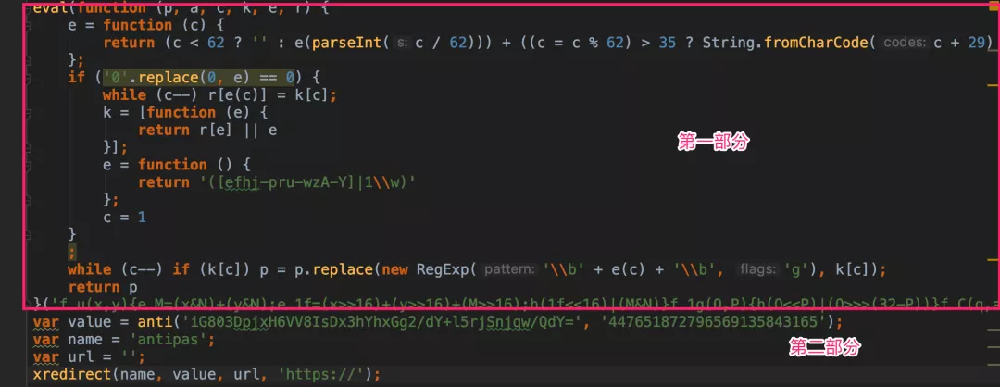
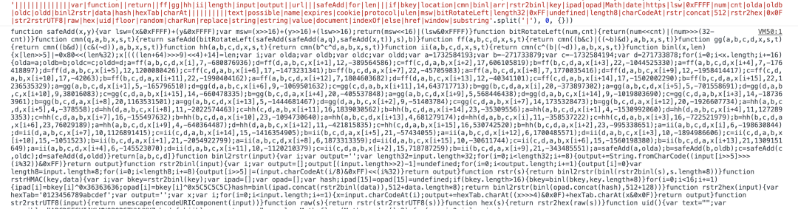

> 原作者：咸鱼学Python

> Python爬虫进阶必备 | 关于某汽车交易网加密 Cookie 的分析

### 目标网站

aHR0cHM6Ly93d3cuZ3VhemkuY29tLw==

这个网站在爬取的时候需要先获取一个名为`antipas` Cookie，见名知意，接下来就一块看看这个字段怎么搞。

### 加密定位

既然是 Cookie 字段，常用的手法是找请求包，看看有没有`set-cookie`这样的操作。

找了一通没有发现关于`antipas`这个字段的写入操作。

可以猜测到应该和之前裁判文书网一样的操作，访问首页后直接生成 Cookie 字段然后跳转。

为了验证我的这个想法，我将请求导入到 Postman 中，并且去掉了 Headers 中的 Cookie ，可以看到返回的就不是正文而是一段 js ，直接验证了我的想法。

接下来就是分析这段 js 的具体逻辑了。

### 加密分析

先将这个代码复制到编辑器当中，格式化代码。【图2-1】

图2-1

可以看到，代码分为两个部分，第一部分是一个 packer ，第二部分是变量的生命和函数调用，第二部分的`xredirect`这个方法没有找到应该是在第一部分的 packer 中。

所以第一步是先解开这个 packer ，前面的文章提过了，直接 console.log 就可以。【图2-2】

图2-2

解开的代码重新格式化后就是简单的 js 代码，可以直接新建 html 调用，在浏览器中调试分析逻辑。

删去一些无用的代码直接调用即可，这里需要注意的是在实际使用过程中，`anti`方法传入的参数是动态改变的，需要动态解析。【图2-3】

图2-3